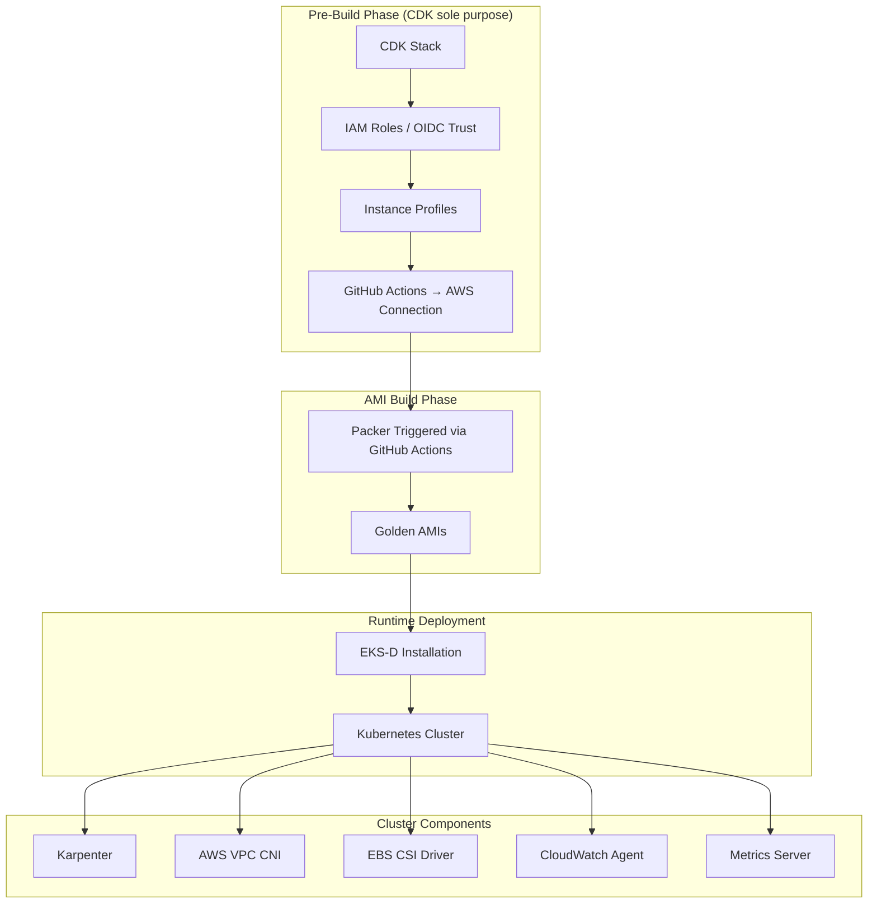
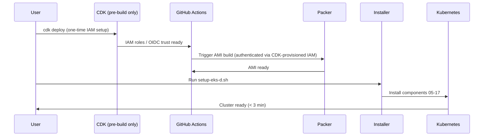
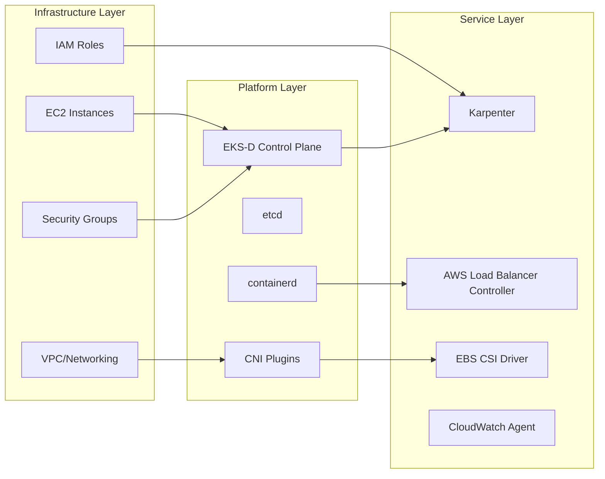

# System Architecture

## High-Level Architecture

## Deployment Pattern

The system uses a sequential, numbered installation approach:

## Component Layers

## Security Architecture

The system implements defense-in-depth security:
- **IAM**: Pod Identity and IRSA for workload authentication
- **Network**: VPC isolation with security groups
- **Authentication**: AWS IAM Authenticator integration
- **Authorization**: Kubernetes RBAC
- **Secrets**: CSR approval automation for certificate management
