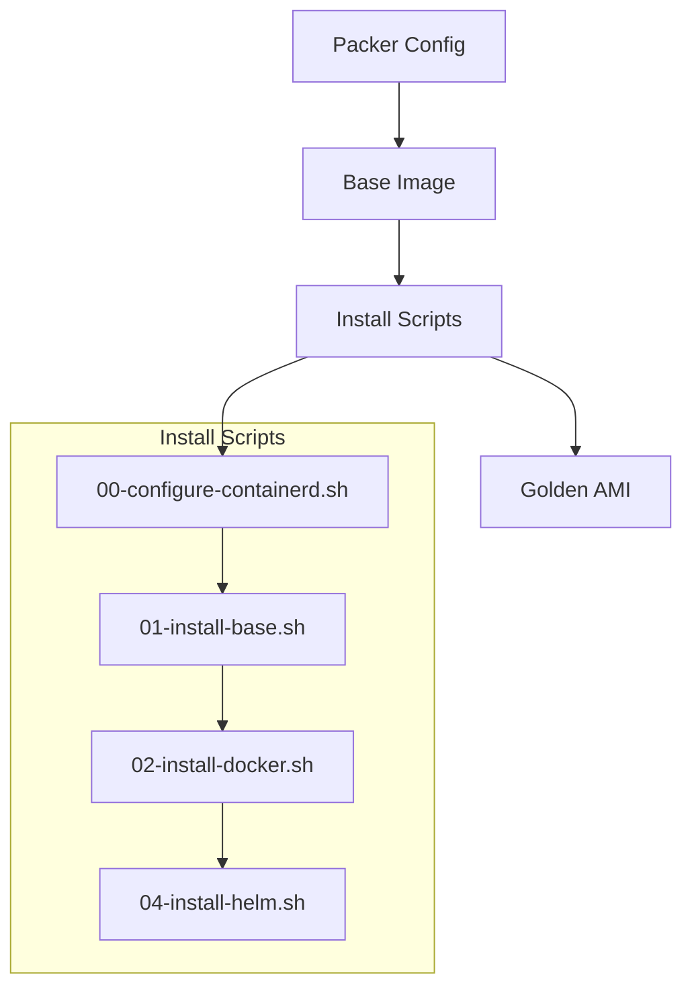
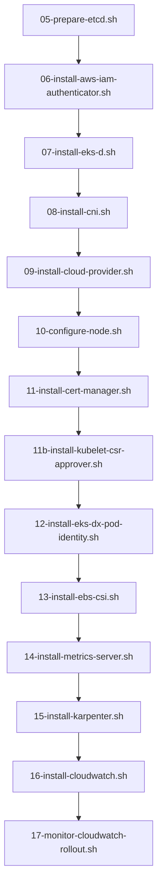
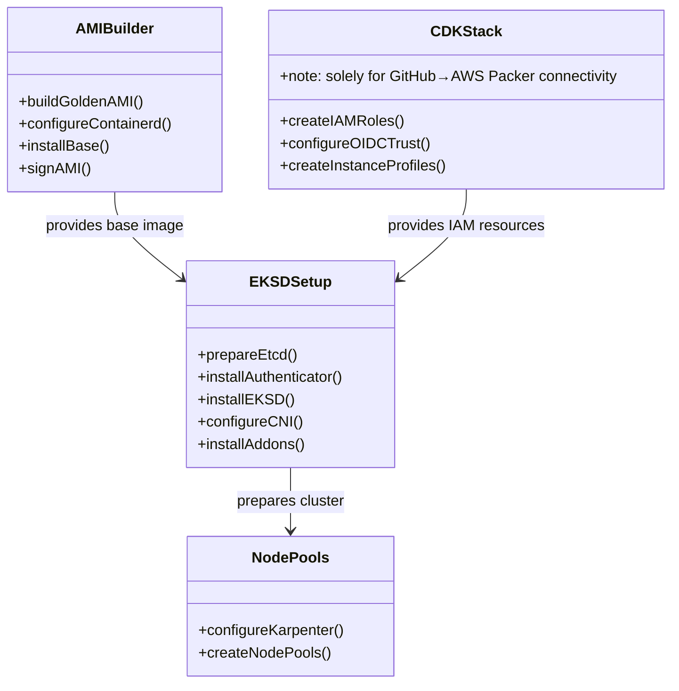

# System Components

## Core Components

### Infrastructure Components
- **CDK Pre-build Setup**: AWS CDK provisions IAM roles, OIDC trust, and instance profiles exclusively to enable GitHub Actions to connect to AWS and trigger Packer AMI builds — CDK is not used for cluster infrastructure
- **AMI Building**: Automated AMI creation with Packer and provisioning scripts (triggered via GitHub Actions using CDK-provisioned IAM resources)
- **EKS-D Setup**: Sequential installation scripts for EKS-D deployment
- **Node Pools**: Karpenter node pool configuration management
- **Monitoring**: CloudWatch and metrics collection setup

### AMI Builder (`ami-builder/`)

**Key Files**:
- `eks-d-xpress.pkr.hcl`: Packer configuration for AMI building
- `build-golden-amis.sh`: Orchestrates AMI creation process
- `scripts/install.sh`: Master installation script (515 LOC)
- `cdk/`: Java CDK stack for IAM permissions

### EKS-D Setup (`eks-d-setup/`)
Sequential installation system with numbered scripts:

**Component Details**:
- **etcd** (05): Distributed key-value store for cluster state
- **IAM Authenticator** (06): AWS integration for authentication (173 LOC)
- **EKS-D Core** (07): Kubernetes control plane installation (122 LOC)
- **CNI** (08): VPC networking plugin installation (75 LOC)
- **Cloud Provider** (09): AWS cloud controller manager
- **Certificate Management** (11): cert-manager and CSR automation
- **Pod Identity** (12): EKS Pod Identity for workload authentication
- **Storage** (13): EBS CSI driver for persistent volumes
- **Monitoring** (14-17): Metrics server and CloudWatch integration
- **Autoscaling** (15): Karpenter for node provisioning (66 LOC)

### Node Pools (`node-pools/`)
- `configure-nodepools.sh`: Karpenter NodePool and EC2NodeClass configuration

## Component Interaction

## Progress Tracking
The system includes built-in progress reporting:
- `progress.sh`: Functions for installation progress tracking
- `workstation-boot.sh`: Initial environment setup
- `reset-cluster.sh`: Cluster reset and cleanup utilities
