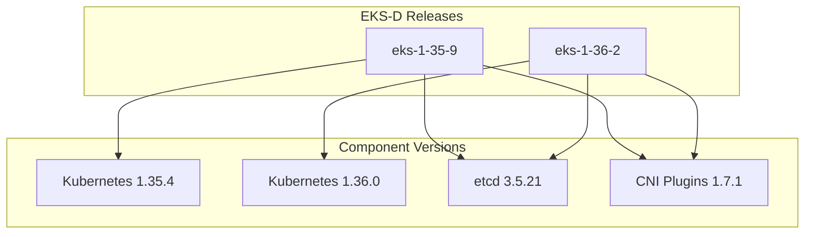

# Data Models and Structures

## Configuration Data Models

### Component Version Matrix
```yaml
# Structure from COMPONENT_VERSIONS.md
components:
  kubernetes:
    - version: "1.35.4"
      eks_release: "eks-1-35-9"
    - version: "1.36.0"  
      eks_release: "eks-1-36-2"
  
  core_components:
    etcd: "v3.5.21"
    coredns: "v1.14.2"
    metrics_server: "v0.7.2"
    
  authentication:
    aws_iam_authenticator: 
      - "v0.7.13"  # for K8s 1.35
      - "v0.7.15"  # for K8s 1.36
```

### Infrastructure Configuration
The only CDK stack in this repo is `EksDXpressPackerIamStack` (IAM/OIDC for Packer CI).
Shared infra (VPC, launch templates) lives in the `eks-d-xpress-infra` repo
(`EksDxSharedInfraStack`), configurable via CDK context keys:

```
projectName         eks-dx (resource name prefix)
instanceTypeArm64   m7g.large
instanceTypeX86_64  m7i.large
diskSizeGb          20
```

## AMI Builder Data Models

### Packer Configuration Structure
```hcl
# eks-d-xpress.pkr.hcl structure
source "amazon-ebs" "x86_64" {
  region        = var.aws_region
  instance_type = "c6a.large"
  source_ami_filter {
    filters = {
      name                = "al2023-ami-2023*-x86_64"
      virtualization-type = "hvm"
      root-device-type    = "ebs"
    }
    owners      = ["amazon"]
    most_recent = true
  }
  ami_name = "eks-d-xpress-x86_64-${var.ami_version}"
}

build {
  sources = ["source.amazon-ebs.x86_64"]
  provisioner "shell" {
    scripts = ["scripts/install.sh"]
  }
}
```

### Installation Script Parameters
```bash
# Environment variables used across installation scripts
export CLUSTER_NAME=""
export AWS_REGION=""
export KUBERNETES_VERSION=""
export EKS_D_RELEASE_BRANCH=""
export NODE_INSTANCE_PROFILE=""
```

## Kubernetes Resource Models

### Karpenter NodePool Structure
```yaml
apiVersion: karpenter.sh/v1
kind: NodePool
metadata:
  name: default
spec:
  template:
    spec:
      requirements:
        - key: karpenter.sh/capacity-type
          operator: In
          values: ["spot", "on-demand"]
```

### Pod Identity Configuration
```yaml
apiVersion: v1
kind: ServiceAccount
metadata:
  name: my-service-account
  annotations:
    eks.amazonaws.com/role-arn: arn:aws:iam::ACCOUNT:role/my-role
```

## Progress Tracking Models

### Installation Progress Structure
```bash
# progress.sh data model
PROGRESS_STAGES=(
  "infrastructure"
  "ami_build"
  "etcd_setup"
  "iam_auth"
  "eks_d_core"
  "networking"
  "storage"
  "monitoring"
  "autoscaling"
)

# Progress state
CURRENT_STAGE=""
STAGE_STATUS=""  # "running" | "completed" | "failed"
ERROR_MESSAGE=""
```

## CDK Data Models

### IAM Stack Structure (ami-builder/cdk/)
```java
// EksDXpressPackerIamStack.java — sole purpose: GitHub Actions → AWS OIDC trust
// so that Packer can build AMIs from GitHub CI
public class EksDXpressPackerIamStack extends Stack {
    private Role packerCiRole;       // assumed by GitHub Actions via OIDC
    // No node role, no karpenter role — those are in the infra stack (separate repo)
}
```

## Component Version Tracking

### Version Compatibility Matrix


## Configuration State Models

### Cluster State Tracking
```json
{
  "cluster": {
    "name": "eks-d-xpress-cluster",
    "version": "1.35.4",
    "status": "running",
    "components": {
      "etcd": {"version": "3.5.21", "status": "healthy"},
      "apiserver": {"version": "1.35.4", "status": "ready"},
      "karpenter": {"version": "latest", "status": "active"}
    }
  }
}
```
