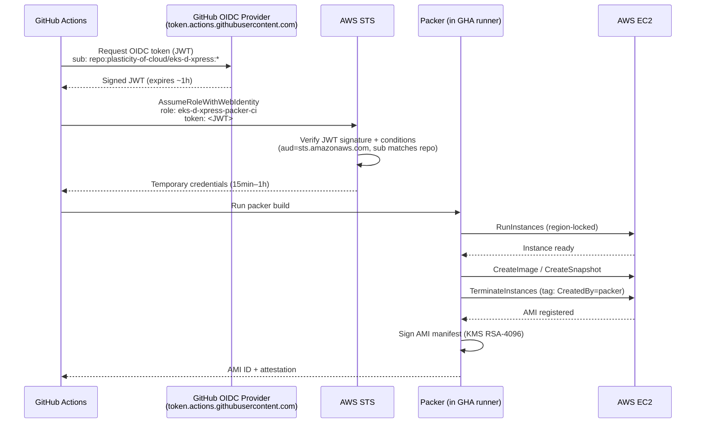

# EksDXpress Packer IAM — GitHub OIDC CI Stack

## Why this exists

Packer needs AWS permissions to build AMIs (launch an EC2 instance, snapshot it, register the image). The old approach used long-lived IAM access keys stored as GitHub secrets — a credential that never expires and can be leaked.

This CDK stack replaces that with **GitHub OIDC federation**: GitHub Actions exchanges a short-lived OIDC token for a temporary AWS session. No static credentials exist anywhere.

## Flow



## What the stack provisions

| Resource | Name | Purpose |
|---|---|---|
| IAM OIDC Provider | `token.actions.githubusercontent.com` | Trusts GitHub-issued JWT tokens |
| IAM Role | `eks-d-xpress-packer-ci` | Assumed by GitHub Actions via OIDC |
| Managed Policy | `eks-d-xpress-packer-boundary` | Permissions boundary — caps any role Packer creates |
| KMS Key | `alias/eks-d-xpress-ami-signing` | RSA-4096 key for AMI attestation signatures |
| SSM Parameter | `/eks-d-xpress/infra/kms/ami-signing-key-arn` | Key ARN for pipeline reference without hardcoding |

## Least-privilege design

Three constraints that were missing from the original `setup-iam.sh`:

**1. Destructive EC2 actions are tag-scoped**
`TerminateInstances`, `DeleteSnapshot`, `DeleteVolume`, etc. require `aws:ResourceTag/CreatedBy = packer`. Packer tags its own resources on creation, so this only allows cleanup of resources Packer owns — not arbitrary instances in the account.

**2. Write actions are region-locked**
`RunInstances`, `CreateImage`, and similar write actions carry an `aws:RequestedRegion` condition matching the deployment region. A compromised token cannot spin up instances in other regions.

**3. IAM role creation is boundary-gated**
`iam:CreateRole` and `iam:PutRolePolicy` are only allowed when `iam:PermissionsBoundary` is set to `eks-d-xpress-packer-boundary`. Without this, Packer could create a role with `AdministratorAccess` and assume it — a privilege escalation path.

## Deploying

```bash
cd ami-builder/cdk
export CDK_DEFAULT_ACCOUNT=$(aws sts get-caller-identity --query Account --output text)
export CDK_DEFAULT_REGION=us-east-1
mvn -q compile
cdk deploy EksDXpressPackerIamGithubStack
```

After deploy, set `AWS_PACKER_ROLE_ARN` in the GitHub repo to the role ARN output.
No other secrets are needed.
