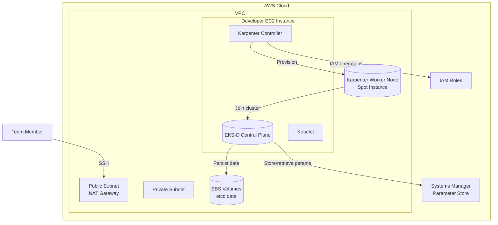
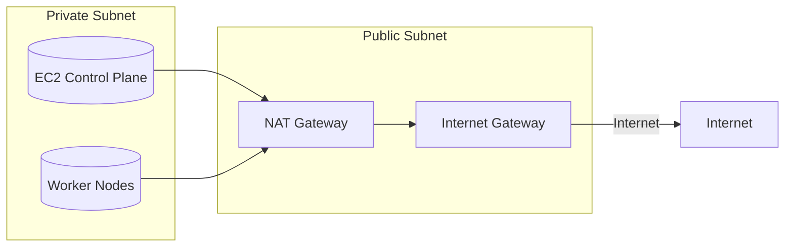
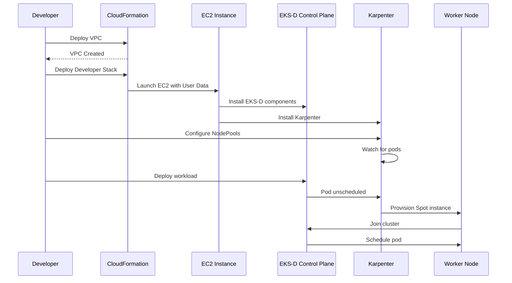

# EKS-D-Xpress Architecture

## Overview

This document describes the architecture of the EKS-D-Xpress deployment, which provides each team member with a dedicated Kubernetes control plane running on EC2, with Karpenter managing worker nodes.

## System Architecture

## Why This Architecture?

### Self-Managed EKS-D on EC2

We run EKS-D (Amazon EKS Distro) on EC2 instead of using managed EKS because:

1. **Cost Optimization**: Control plane runs on Compute Savings Plan eligible instances
2. **Full Control**: Complete access to control plane configuration
3. **No EKS Control Plane Fees**: Avoids $0.10/hour EKS cluster fees
4. **Learning**: Deep understanding of Kubernetes internals

### Karpenter for Worker Nodes

Karpenter manages worker nodes because:

1. **Spot Integration**: Automatic use of Spot instances for 60-90% savings
2. **Right-sizing**: Provisions right-sized instances based on workload
3. **Fast Scaling**: Seconds instead of minutes for node provisioning
4. **Native AWS**: Built by AWS, deeply integrated with EC2

## Component Details

### EKS-D Control Plane

The control plane runs on a dedicated EC2 instance and includes:

| Component | Purpose |
|-----------|---------|
| kube-apiserver | Kubernetes API server |
| etcd | Distributed key-value store for cluster state |
| kube-controller-manager | Controllers that regulate cluster state |
| kube-scheduler | Schedules pods to nodes |
| kubelet | Agent that manages containers on the node |

### Karpenter

Karpenter consists of:

- **Controller**: Runs in the cluster, watches for unscheduled pods
- **EC2NodeClass**: Defines EC2 instance configuration (AMI, subnet, security groups)
- **NodePool**: Defines capacity requirements and limits

## Network Architecture

- **Public Subnet**: Contains NAT Gateway for outbound internet access
- **Private Subnet**: Contains EC2 instances, worker nodes
- **Security Groups**: Control plane SG, Worker node SG with appropriate rules

## Data Flow

## Cost Structure

| Resource | Cost Model | Estimated Monthly |
|----------|------------|-------------------|
| Control Plane EC2 | On-Demand + Savings Plan | $50-100 |
| Worker Nodes | Spot Instances | $0 (when not running) |
| EBS Volumes | gp3 storage | $20-40 |
| NAT Gateway | Fixed fee | ~$30 |

See [cost-estimation.md](../../cost-estimation.md) for detailed breakdown.
