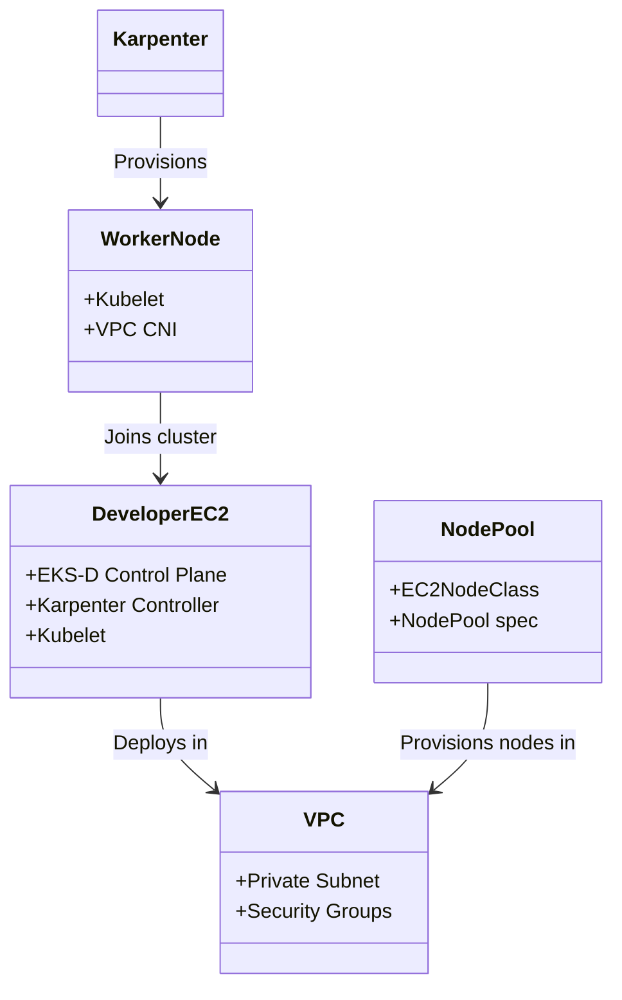

# Component Reference

## Core Components

### EKS-D Control Plane

The EKS-D control plane is the Kubernetes control plane running on a dedicated EC2 instance.

**Installation**: `eks-d-setup/06-install-eks-d.sh`

**Components**:
- `kube-apiserver` - REST API server for Kubernetes
- `kube-controller-manager` - Runs controller loops
- `kube-scheduler` - Assigns pods to nodes
- `etcd` - Cluster state database
- `kubelet` - Node agent

**Configuration**:
- Data directory: `/var/lib/etcd`
- Certificate directory: `/etc/kubernetes/pki`
- Manifest directory: `/etc/kubernetes/manifests`

### Karpenter

Karpenter is an open-source node provisioning project for Kubernetes.

**Installation**: 
- `karpenter-config/install-karpenter.sh`
- `eks-d-setup/11-install-karpenter.sh`

**Resources**:

```yaml
# EC2NodeClass - defines instance configuration
apiVersion: karpenter.k8s.aws/v1
kind: EC2NodeClass
metadata:
  name: default
spec:
  amiFamily: AL2023
  role: <developer-signum>-eks-d-worker-node-role
  subnetSelectorTerms:
    - id: <private-subnet-id>
  securityGroupSelectorTerms:
    - id: <worker-sg-id>
```

```yaml
# NodePool - defines capacity requirements
apiVersion: karpenter.sh/v1
kind: NodePool
metadata:
  name: default
spec:
  template:
    spec:
      nodeClassRef:
        name: default
      requirements:
        - key: karpenter.sh/capacity-type
          operator: In
          values: ["spot"]
  limits:
    cpu: 100
    memory: 100Gi
  disruption:
    consolidationPolicy: WhenEmptyOrUnderutilized
    consolidateAfter: 1m
```

### VPC CNI

The VPC Container Network Interface provides pod networking.

**Installation**: `eks-d-setup/07-install-cni.sh`

**Purpose**: Assigns VPC IP addresses to pods

### CoreDNS

CoreDNS provides DNS service for the cluster.

**Installation**: `eks-d-setup/08-install-coredns.sh`

**Purpose**: Cluster DNS resolution

### EBS CSI Driver

The EBS Container Storage Interface driver enables EBS volume usage.

**Installation**: `eks-d-setup/09-install-ebs-csi.sh`

**Purpose**: Persistent storage for workloads

## Supporting Components

| Component | Install Script | Purpose |
|-----------|----------------|---------|
| Docker | `eks-d-setup/02-install-docker.sh` | Container runtime |
| kubectl | `eks-d-setup/03-install-kubectl.sh` | Kubernetes CLI |
| Helm | `eks-d-setup/04-install-helm.sh` | Package manager |
| CloudWatch | `monitoring/cloudwatch-setup.yaml` | Monitoring |

## Component Relationships



## File Locations

| Component | Location |
|-----------|----------|
| Installation scripts | `eks-d-setup/` |
| Karpenter config | `karpenter-config/` |
| NodePool definitions | `node-pools/` |
| CloudFormation templates | `infrastructure/` |
| Monitoring | `monitoring/` |
